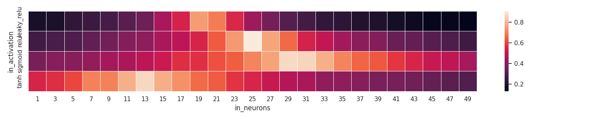
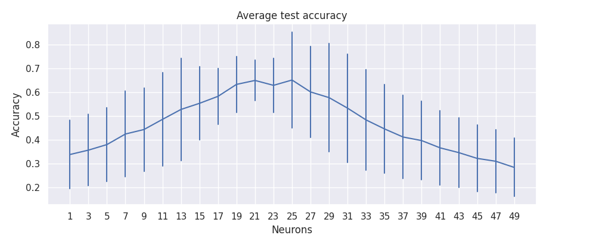

# Patas 🐾

Patas is a command line utility designed to execute any program in parallel and collect its output, varying its input parameters and starting the programs automatically. The script may be parallelized on your local machine or in a cluster. The only requirement to run it on a cluster is an SSH connection between the machines. Assuming the programs are located on each worker machine, patas can start and manage the parallel programs with one command. Parsing the outputs is done in a second command. Its name means PArser and TAsk Scheduler.

# When should I use Patas? ⭐

Use this program if you want to evaluate your model against multiple parameters and measure your own performance metrics. It is a quick way to parallelize an experiment over various machines. It is also handy when you don't want to, or can't, change the original program.

# When should I not use Patas? 🚧

Patas is designed to be a simple command line utility. It will not manage and constrain resource usage, like limiting the amount of RAM, cores, or disk used by the process. The only control available is the number of workers in each machine, representing how many processes we want to execute in the given machine. The reason for this is that when we constrain the process with a given amount of resources, like RAM, it's possible that a process will run out of memory, and the entire system has plenty of it available. The workaround is to estimate the number of workers based on how many resources your program needs. If a machine crashes, its ok, you can stop and execute patas again. It will skip completed tasks and continue from where it stopped.

# Concepts

## Sub commands

* `patas explore` - command to execute programs in parallel and collect their stouts. It will combine multiple variables and use each combination as input parameter.

* `patas parse` - used to parse the programs stout and consolidate them in a single csv file. It uses regular expressions to locate the metrics that must be collected.

* `patas query` - apply sql queries directly into the generated csv files.

* `patas draw` - convert your csv files to graphics for quick visualization.

## Internal concepts

* `Experiment` - represents an execution and the stdout generated. Its configuration parameters include mainly the command lines to be executed and input variables.

* `Command` - the command line that paths will use to start the application. It contains variable fields that will be replaced by variable values by patas.

* `Combination` - represents one possible combination of input variables. If you define two variables, each with 5 possible values, you will end with 25 combinations.

* `Task` - represents a single program execution. If you have 25 combinations and the experiment is configured to repeat each of them 10 times, the number of tasks in the experiment is 250.

* `Node` - a machine that will run the experiment, hosting the number of workers selected for it.

* `Cluster` - a set of nodes. May contain special tags that will allow us to filter them during an experiment.

* `Scheduler` - an internal object responsible for orchestrating the tasks and associating them to a worker.

* `Worker` - represents the maximum number of parallel processes that may run at once in a node. A node may have one or more workers running in parallel.

* `Variable` - an input parameter for the program. This is typically a list of values that will be combined with other variables and defines the number of tasks that will be created.

* `Pattern` - a regex containing a single group that will capture an output variable, i.e., a metric.


# Basic usage 🐣

Considering a use case that we need to find the optimal configuration for a neural network. In this case we are interested in variating the number of hidden neurons and the activation function in the hidden layer. We want to execute our prgoram multiple times, combining the values of these two parameters, and collect metrics of interest, like train and test accuracies. We then want to analyse this output and select the best configuration. The following subsections will describe how to achieve this.

## The program

We will use a mockup code present in `examples/basic_usage`. This is a script that pretends to run a neural network, receiving the two variables of interest and printing the desired metrics to stdout. This could easily be replaced by a real program training a neural network, but we use a mockup to speed up the process. To access this program you just need to access the folder.

```shell
# Enter the program folder
cd examples/basic_usage

# Example of program execution
./main.py 100 relu
```

## patas explore

Assuming we want to vary the number of hidden neurons from `1` to `51` with steps of `2` and the activation function in `['relu' 'leaky_relu' 'sigmoid' 'tanh']`, we can generate all combinationsand parallelize the script above using `patas explore grid`. This will also collect its entire stdout and save them in the folder `patasout/grid`. Each combination will be executed `10` times, as we want to measure the average accuracies later.

```shell
patas explore grid \
    --cmd './main.py {neurons} {activation}' \
    --va neurons 1 51 2 \
    --vl activation relu leaky_relu sigmoid tanh \
    --repeat 10
```

The parameter `--cmd` define the command that must be executed. If we define more than one `--cmd` they will all be executed, one after the other. The parameter `--vl` defines a variable of type list, it receives the variable name and the list of values it can receive. Next, the parameter `--repeat` defines the number of times the program will be called using a given variable combination. In this example, the parameter neurons define `26` values and the paramter activation define `4` values. This will generate `104 combinations`. Considering the repeat parameter has the value `10`, the program will be excuted `1040` times. That is, patas will have `1040 tasks` to do. You can define as many variable as you want, but the more you have the longer it will take to execute, growing exponentially.

## patas parse

When the experiment is done executing, we can parse its outputs and collect the desired values using `patas parse`.

```shell
patas parse \
    -e 'patasout/grid/' \
    -p train_acc  'Train accuracy:     (@float@)' \
    -p test_acc   'Test accuracy:      (@float@)'
```

The parameter `-e` define the experiment folder, containing the prgoram outputs and a few extra info. The parameter `-p` define a pattern patas is going to look for. It receives a name and a regular expression string. The output file will be saved in `patasout/grid/grid.csv`. This contains a table with the input variables, collected results, and extra variables associated to the experiment. 

## patas query

We use `patas query` to inspect the contents of the csv file generated above. This command works with any csv file and recognizes the experiment names as table names.

```shell
patas query 'select * from grid limit 2' -m
```

The parameter `-m` asks patas to print the output in markdown format.
The output for the command above should have a similar structure to the content bellow. The values may vary as the script is non-determininstic.

| in_activation | in_neurons | out_train_acc | out_test_acc | break_id | task_id | repeat_id | combination_id | experiment_id | experiment_name | duration |          started_at |            ended_at | tries | max_tries | cluster_id | cluster_name | node_id | node_name | worker_id | output_dir                                                       | work_dir                                       |
| ------------- | ---------- | ------------- | ------------ | -------- | ------- | --------- | -------------- | ------------- | --------------- | -------- | ------------------- | ------------------- | ----- | --------- | ---------- | ------------ | ------- | --------- | --------- | ---------------------------------------------------------------- | ---------------------------------------------- |
| leaky_relu    |         25 |         0,487 |        0,452 |    False |     386 |         6 |             38 |         False | grid            |   0,048… | 2023-05-11 14:13:34 | 2023-05-11 14:13:34 |  True |         3 |      False | cluster      |   False | localhost |         7 | /home/ubuntu/Sources/patas/examples/basic_usage/patasout/grid/386 | /home/ubuntu/Sources/patas/examples/basic_usage |
| sigmoid       |         27 |         0,841 |        0,820 |    False |     652 |         2 |             65 |         False | grid            |   0,055… | 2023-05-11 14:13:34 | 2023-05-11 14:13:34 |  True |         3 |      False | cluster      |   False | localhost |        57 | /home/ubuntu/Sources/patas/examples/basic_usage/patasout/grid/652 | /home/ubuntu/Sources/patas/examples/basic_usage |

We must remember that for every combination, patas will execute the program `--repeat` times, passing the same input parameters and collecting multiple output variables. This is useful when the algorithm we are evaluating is non-deterministic and we wish to collect reliable metrics, like our script. To aggregate these values we can calculate the average value using the `AVG` function with the `GROUP BY` statement.

```shell
patas query '
    SELECT in_activation, 
           in_neurons, 
           AVG(out_train_acc) AS avg_train_acc, 
           AVG(out_test_acc) AS avg_test_acc
    FROM grid GROUP BY in_activation, in_neurons' -m
```


Similarly, to pick the input parameters that gave us the best average test_accuracy, we could use something like.

```shell
patas query '
    WITH avg_result AS (
        SELECT in_activation, 
               in_neurons, 
               AVG(out_train_acc) AS train_acc, 
               AVG(out_test_acc) AS test_acc 
        FROM grid 
        GROUP BY in_activation, in_neurons
    )
    SELECT * FROM avg_result AS t 
    WHERE t.test_acc=(SELECT MAX(test_acc) FROM avg_result)' -m
```

A possible output for the previous command would be.

| in_activation | in_neurons | train_acc | test_acc |
| ------------- | ---------- | --------- | -------- |
| relu          |          5 |    0,995… |   0,946… |

## patas draw

Patas will also help you quickly create basic graphics based on the data in the csv file. This might help you inspect the data and get some quick insights. As of now, patas supports three graphic types, `heatmap`, `bars`, and `lines`.

### Heatmap

```shell
patas draw heatmap \
    --input patasout/grid/grid.csv \
    --x-column in_neurons \
    --y-column in_activation \
    --z-column out_test_acc \
    --size 10 2
```



### Bars

TODO


### Lines

TODO



# TL;DR 💻

```shell
# Parallelizing a program in the local machine. Use the local directory as workdir
patas explore grid \
    --cmd './main.py {neurons} {activation}' \
    --vl neurons 5 10 15 20 25 30 \
    --vl activation relu leaky_relu sigmoid tanh \
    --repeat 2

# Parsing the program output
patas parse \
    -e 'pandasout/grid/' \
    -p TRAIN_ACC  'Train accuracy: (@float@)' \
    -p TEST_ACC   'Test accuracy:  (@float@)'

# Query CSV experiment files using SQL
patas query 'select * from grid' -m
```

# Source Code 🎼

The source code is available in the project's [repository](https://github.com/ubuntufps/patas).
